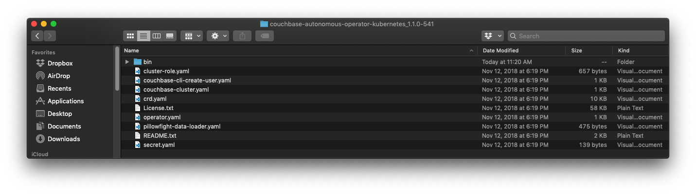
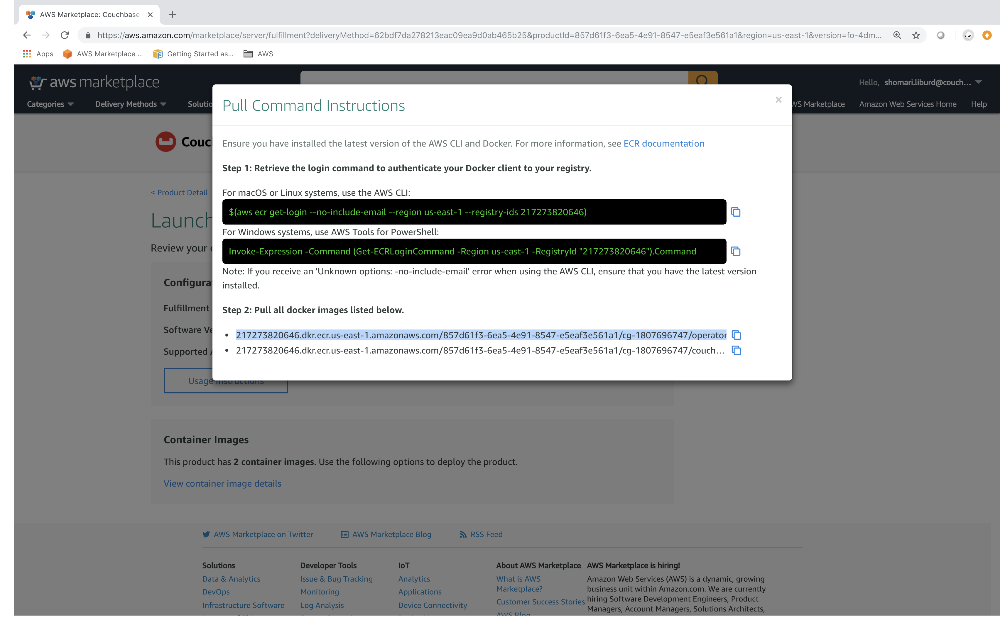
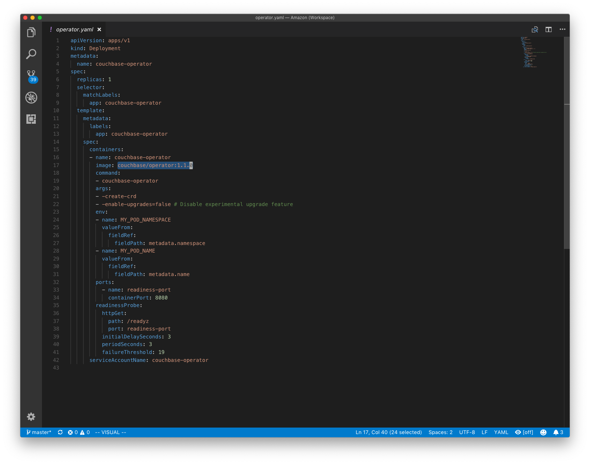
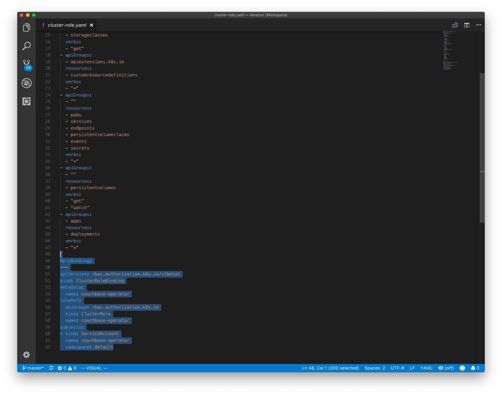
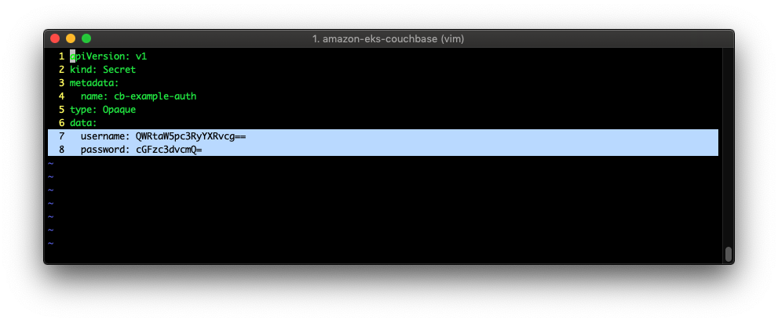
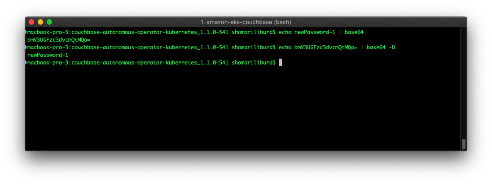

# amazon-eks-couchbase

Nowadays it seems like everyone loves Kubernetes and our team at Couchbase is no different. The [Couchbase Operator](https://blog.couchbase.com/introducing-couchbase-operator/) makes managing a Couchbase cluster running on Kubernetes even easier.

Kubernetes sums up what an [Operator](https://coreos.com/operators/) is quite well:

>An Operator represents human operational knowledge in software to reliably manage an application

With that established, the next question is how do we use that in the cloud and with a Kubernetes Managed Service.  Amazon's answer to that is [Amazon Elastic Container Service for Kubernetes (EKS)](https://aws.amazon.com/eks/).

Here is a summary of EKS:

>Amazon Elastic Container Service for Kubernetes (Amazon EKS) is a managed service that makes it easy for you to run Kubernetes on AWS without needing to install and operate your own Kubernetes clusters.

## Major steps of this walkthrough

It may feel like there is a lot going on here, but we can break the tasks into palatable parts.  The three major parts of this walkthrough are:

1. Create an EKS cluster ([userguide](https://docs.aws.amazon.com/eks/latest/userguide/getting-started.html))
2. Deploy the Couchbase Operator
3. Create a Couchbase cluster
4. Examine the cluster using the Couchbase Web Console

Now let's tackle each section.

### Create an EKS Cluster

Amazon has provided some quality documentation on setting up your environment and creating an EKS cluster.  We will leverage that documentation for our purposes.

Follow the [userguide](https://docs.aws.amazon.com/eks/latest/userguide/getting-started.html), completing steps up to "__*Step 3: Launch and Configure Amazon EKS Worker Nodes*__".

We will be deploying the Couchbase Operator and a Couchbase cluster so we can ignore "Step 4: "Launch a Guest Book Application".

When we have completed the getting started steps we should be at the point illustrated below:


#### Validate the EKS setup

After following the userguide we should have two stacks [deployed](https://us-west-2.console.aws.amazon.com/cloudformation/home?region=us-west-2):


We should also have a cluster in [EKS](https://console.aws.amazon.com/eks/home?region=us-west-2):


Let's verify our setup by checking our nodes using kubectl.

Run the command:

    kubectl get nodes


### Role-based Access Control (RBAC)

#### Foundational Knowledge

Kubernetes uses RBAC which gives us flexibility on who and how our pods are controlled.  For those that are not familiar with RBAC let's break down the the concepts that are important for our walkthrough.

The first concept will cover is the **_service account_** (as explained by Kubernetes):
>A service account provides an identity for processes that run in a Pod.

Next we will tackle the concept of a **_cluster role_**.  Roles exist as well, but for simplicity we will focus on cluster roles.  Again as explained by Kubernetes:

>In the RBAC API, a role contains rules that represent a set of permissions. Permissions are purely additive (there are no “deny” rules). A role can be defined within a namespace with a Role, or cluster-wide with a ClusterRole.

Now that we understand what a service account and cluster role is, the final step is to assign a cluster role to a service account and that is the cluster role binding step (you guessed it, as explained by Kubernetes).

>Finally, a ClusterRoleBinding may be used to grant permission at the cluster level and in all namespaces. The following ClusterRoleBinding allows any user in the group “manager” to read secrets in any namespace.

We haven't discussed namespaces but you may think of them as a way to make virtual clusters out of a single Kubernetes cluster.  We are using the "default" namespace that is always available, and we are using a cluster role so namespaces are not that important for our walkthrough.

#### Download the Couchbase Autonomous Operator

Most of the files we will need are in a neat bundle for [Linux](https://s3.amazonaws.com/packages.couchbase.com/kubernetes/1.1.0/couchbase-autonomous-operator-kubernetes_1.1.0-linux_x86_64.tar.gz), [macOS](https://s3.amazonaws.com/packages.couchbase.com/kubernetes/1.1.0/couchbase-autonomous-operator-kubernetes_1.1.0-macos_x86_64.zip) or [Windows](https://s3.amazonaws.com/packages.couchbase.com/kubernetes/1.1.0/couchbase-autonomous-operator-kubernetes_1.1.0-windows_amd64.zip)

After downloading and expanding the archive your folder structure should look like the screenshot below.


Going forward the working directory should have these files available.

#### Amazon Container Marketplace

If you have been directed here from the Amazon Container Marketplace first we need to edit a couple of lines.  We will copy the ECR image link and replace the current image reference **operator.yaml**.



Use the operator image link for the (shown in the image above) to replace the image referenced in the image below:


#### Setting up RBAC

In order for the Couchbase Operator to be able to create resources within our Kubernetes cluster we have to grant it permission.  The RBAC process has a few simple steps:

1. Create a Service Account
2. Create a clusterRole and bind it to the ServiceAccount

OK now let's create a new Service Account called couchbase-operator in the default [namespace](https://kubernetes.io/docs/tasks/administer-cluster/namespaces-walkthrough/#step-one-understand-the-default-namespace).

Create a file called **serviceaccount-couchbase-operator.yaml** with the contents below:

```script
kind: ServiceAccount
apiVersion: v1
metadata:
  name: couchbase-operator
  namespace: default
```

Run the command to create the Service Account:

    kubectl apply -f serviceaccount-couchbase-operator.yaml

Next we create a _cluster role_ and bind it to our newly created _service account_ (all in the same file).

Edit the file **cluster-role.yaml** and insert the content below to the end of the file (there is a empty line before 'RoleBinding').

```script

RoleBinding:
---
apiVersion: rbac.authorization.k8s.io/v1beta1
kind: ClusterRoleBinding
metadata:
  name: couchbase-operator
roleRef:
  apiGroup: rbac.authorization.k8s.io
  kind: ClusterRole
  name: couchbase-operator
subjects:
- kind: ServiceAccount
  name: couchbase-operator
  namespace: default
---
```


Now apply the file. Remember this is creating the Cluster Role and Binding the role to our Service Account.

    kubectl apply -f cluster-role.yaml


### Deploy the Couchbase Operator

Now that we have setup RBAC, we are finally ready to deploy the Couchbase Operator (which will manage our Couchbase clusters).  I wont go into the details of the Couchbase Operator here, but If you are interested in learning more you may find this [overview](https://www.couchbase.com/products/cloud/kubernetes) as a good starting point.

We are finally ready to deploy the Couchbase Autonomous Operator with:

    kubectl apply -f operator.yaml


The Couchbase Operator is deployed.  Now we verify it by running:

    kubectl get deployments


### Deploying a Couchbase Cluster

#### Setting The Couchbase Cluster Credentials

To create your Couchbase Cluster credentials, edit username and password (**both values must be base64 encoded**) in the file **secret.yaml**.



The image below shows how to base64 encode and decode on a linux/macos platform for an example value of "newPassword-1".



Apply the secret then create the Couchbase cluster with the following commands:

    kubectl apply -f secret.yaml
    kubectl apply -f couchbase-cluster.yaml

The output should be similar to the image below:


We can view the all of the pods by running:

    kubectl get pods


#### Accessing the Couchbase Web Console

Now we have a Couchbase cluster running!

To use the Couchbase Web Console we will need to setup port forwarding.

In a **new terminal window** run:

    kubectl port-forward cb-example-0000 8091:8091

Make sure to leave the command running in the terminal:


Now we can open up a browser at [http://localhost:8091](http://localhost:8091)


Login with the credentials you created earlier (be sure to use the the base64 **decoded** values)

Click the 'Servers' link on the left side and we should see our clusters running.


Fin